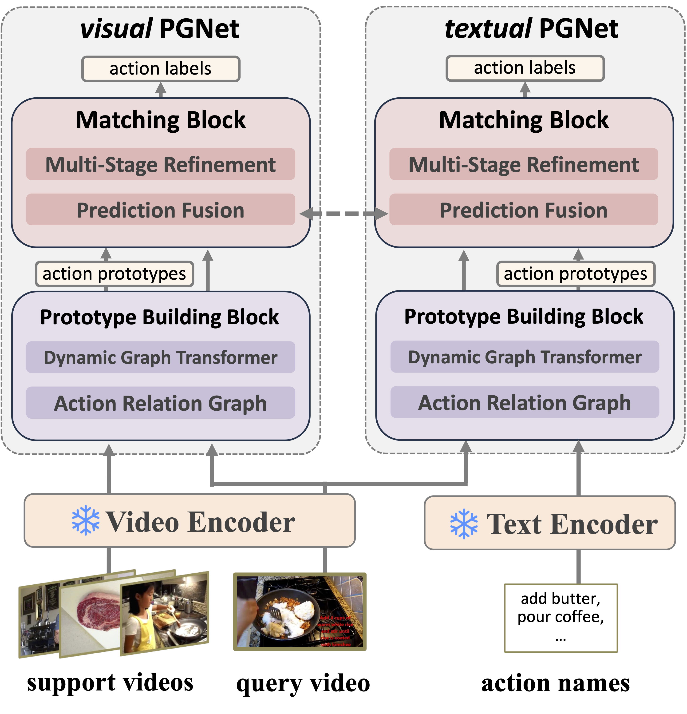

<h2 align="center"> <a href="https://openaccess.thecvf.com/content/ICCV2025/html/Lu_Multi-Modal_Few-Shot_Temporal_Action_Segmentation_ICCV_2025_paper.html">Multi-Modal Few-shot Temporal Action Segmentation</a></h2>

We propose a new problem of **Multi-Modal Few-shot Temporal Action Segmentation** (MMF-TAS), which aims for open-world models that can segment procedural videos from unseen tasks with just a few example videos. Our model, **Protototype Graph Network** (PGNet), is a multi-modal model that is trained for few-shot learning but can address various zero-shot, few-shot settings at test time.

<p align="center">

</p>

## Preparation

### 1. Install the Requirements
```shell
conda env create -f environment.yml
```

### 2. Prepare Codes
```shell
mkdir PGNet
cd PGNet
git clone https://github.com/ZijiaLewisLu/ICCV2025-MMF-TAS.git
mv ICCV2025-MMF-TAS src
```

### 3. Prepare Data
- download dataset folder from [here](https://drive.google.com/file/d/1QWLZBsLaWRn1p4y6OdYnUasm5EjX3DUc/view?usp=sharing) and place it under folder `PGNet`

## Training
The training is configured using YAML, and all the configurations are listed in [configs](./configs). You can use the following commands to run the experiments.
```shell
cd PGNet
# crosstask 3way 3shot
python3 -m src.train --cfg src/configs/crosstask_3t3v.yaml --set aux.gpu 0 aux.runid 1
# crosstask 5way 3shot
python3 -m src.train --cfg src/configs/crosstask_5t3v.yaml --set aux.gpu 0 aux.runid 1
# coin 3way 3shot
python3 -m src.train --cfg src/configs/coin_3t3v.yaml --set aux.gpu 0 aux.runid 1
# coin 5way 3shot
python3 -m src.train --cfg src/configs/coin_5t3v.yaml --set aux.gpu 0 aux.runid 1
```
By default, log will be saved to `PGNet/log/<experiment-path>`. Evaluation results are saved as `Checkpoint` objects defined in [utils/analysis.py](./utils/analysis.py). Optionally, the code can use Weight and Bias to visualize loss and metric curves via setting `cfg.aux.use_wandb` to True.

If you want to add your dataset, please refer to `utils/dataset.py - get_dataset_config()`.

## Pre-Trained Models
Pre-trained model weights can be downloaded from [here](https://drive.google.com/file/d/1Bb7Hl6pzExpAozsHWpuOP5sp36ijiaXH/view?usp=sharing). Place the folder as `PGNet/model_weights` and test the models with the following command.
```shell
python3 -m src.eval
```
Modify the `mode` variable in code to test model under different settings.


## Citation
```text
@InProceedings{Lu_2025_ICCV,
    author    = {Lu, Zijia and Elhamifar, Ehsan},
    title     = {Multi-Modal Few-Shot Temporal Action Segmentation},
    booktitle = {Proceedings of the IEEE/CVF International Conference on Computer Vision (ICCV)},
    month     = {October},
    year      = {2025},
    pages     = {14106-14116}
}
```
